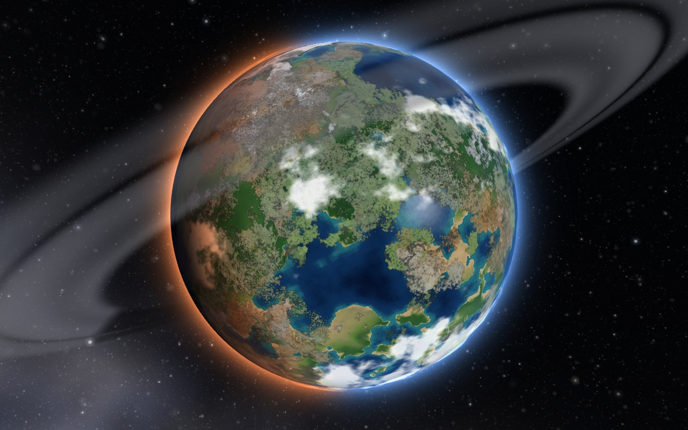
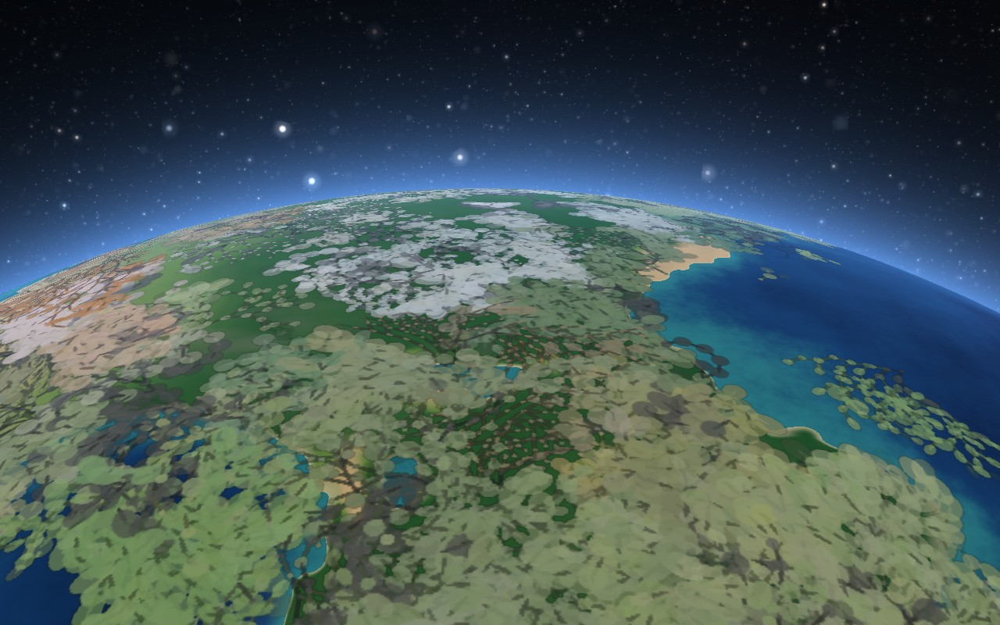
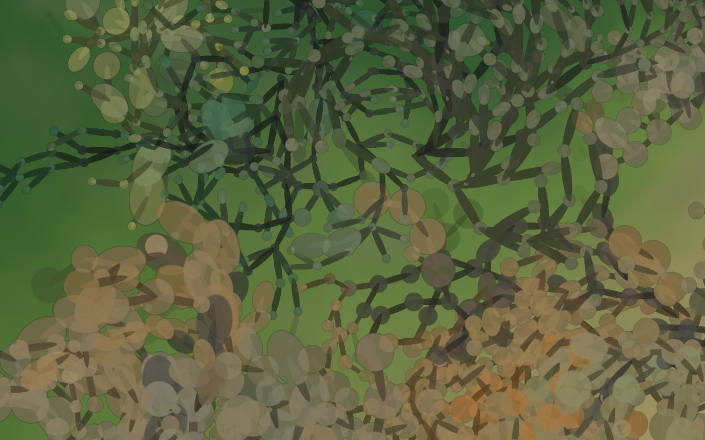

# Aetheris

**A world, slowly becoming.** A procedural planet that never stops changing — and never runs away.

**→ [See it live](https://donmarshworks.github.io/aetheris/)**



Coastlines drift and reshape. Forests spread into grassland, grassland dries into desert, desert is recolonised. Snow advances and retreats with the seasons; ice sheets grow ragged tongues and then collapse. And living on all of it is a population of plants that grow, compete for room, age, die and **evolve** — nobody wrote down what they would become.

Nothing repeats, nothing is scripted, and no environment ever disappears or takes over.

One HTML file. No dependencies, no build step, nothing fetched from the network.

## Watching it

Leave it running. The interesting thing about the piece is the timescale — it is meant to reward being ignored for an hour.

If you want to see the change without waiting, the ×20 and ×100 controls compress an hour into minutes.

| | |
|---|---|
| **drag** | orbit the camera |
| **scroll** or **pinch** | zoom (close in and the clouds and ring dissolve) |
| **click / tap** | show or hide the interface |
| **play button** or **space** | pause |
| **rocket button** | hand the camera to a pilot and watch |
| **what is this?** | a page explaining the world, the plants and the controls |
| **×1 / ×20 / ×100** or **1 / 2 / 3** | time-lapse |

The rocket is the one to press if you are going to leave it running. The camera
picks somewhere to be — out where the whole world sits in space, round the dark
side while the lit crescent widens, still while the planet turns beneath, held
over one piece of ground, edge-on to the ring, over a pole, low down with the
horizon across the frame and the surface running past — flies there, stays
fifteen seconds, and then picks somewhere else. It never repeats itself and it
never hurries: every leg leaves and arrives at rest, and it banks on to a new
heading rather than rolling on to its back. The sun gets a vote on where it goes,
so a low pass is over ground you can see, and often over ground going into
evening while you watch it. Press the rocket again to take the camera back.

On touch devices one finger orbits and two pinch to zoom. The page itself
cannot be zoomed or scrolled — the interface stays a fixed size while only
the planet scales.

Every visit generates a different world. To return to a particular one, append its seed to the URL:

```
https://donmarshworks.github.io/aetheris/#seed=31337
```

The settings panel writes a fuller link, carrying the seed and every dial. What
it cannot carry is *elapsed time* — a link always starts its world from the
beginning, so leave it running to reach what you were looking at. And if you
moved a dial part way through, it will not even do that: the world you were
watching took a path that a set of final values cannot describe. The panel says
so, underneath the link, once you have changed something.

## The part that took the thinking

The hard problem is not making a planet change. It is making a planet change *forever* without degenerating — because any system with feedback and no governor eventually finds a corner and stays there. Left alone, a world like this becomes a snowball, or an ocean, or one continuous desert, and then nothing happens ever again.

So the climate runs as a **control loop**. Three global dials — sea level, mean temperature, atmospheric humidity — are steered by measuring the world and correcting it:

- ocean coverage drifts from target → sea level is nudged
- ice coverage drifts → global temperature is nudged, with polar amplification so the ice line can move without cooking the tropics
- desert share of land drifts → humidity is nudged

The corrections are rate-limited, so the loop stays stable even when the time-lapse hands it a huge step. Local weather, vegetation and terrain are free to wander; only the global budget is held. The result is a world with weather, seasons, droughts and ice ages, none of which are permanent.

## The life on it

The plants are not a texture. Each grows outward from a single node, one step at
a time, and every node carries a genome that is a **small program** rather than a
set of numbers — a fixed-length instruction list over a bank of registers, run
whenever the plant considers growing. It decides how many children the node may
have, which way they go, how far, how long the node takes to mature and how long
it lives. Where a branch forks, the new branch takes a mutated copy, so a single
body can carry more than one strain inside it.

What a plant is *suited to* is neither fixed nor freely chosen. Each node
inherits five affinities — for sea, ice, desert, grassland and forest — and as
it is born its own program adjusts them, within a bounded factor, according to
what it can see of where it has ended up. The five are then renormalised to a
**fixed total**: no plant can be
good at everything.

Letting the program *set* an affinity outright rather than adjust one is a trap
— a node that can read the ground and name its own affinity
copies whatever it is standing on, scores maximum fit everywhere, and the niche
structure dissolves into a single immortal generalist.



*From the tour's shuttle window, 1.5 planetary radii up. The plants are
individual branching bodies at this range, not a texture laid over the ground.*



*Close in, they are branching structures rather than texture — and the ones that look alike are alike, because color is projected from the genome rather than picked per lineage.*

Color is information rather than decoration — hue is which environment a lineage
is built for, vividness is how committed it is, lightness is whether it is a fast
colonizer or a slow persister.

## How it works

**Terrain.** Six octaves of Perlin noise sampled on the sphere, each slowly rotating on its own axis and breathing in amplitude. That drift is what moves coastlines: continents genuinely change shape rather than looping through a cycle. A ridged noise term adds mountain belts over land.

**Climate.** A 320×160 latitude/longitude grid, stepped about 12 times a second. Temperature from latitude, solar declination, elevation and a drifting anomaly field. Moisture from ocean proximity (a blurred distance-to-water field) crossed with Hadley-cell latitude bands, so deserts form around 30° and rainforest at the equator. Vegetation grows where it is warm and wet enough, dies back where it is not, and **diffuses into its neighbors** — which is what produces visible colonization fronts rather than blocks of biome switching state.

**Ice.** Snow tracks temperature, but with an albedo feedback: white ground keeps itself cold. That positive feedback plus lateral diffusion is why ice sheets are sticky and ragged, growing peninsulas and stranding floes, instead of tracking a latitude circle.

**The ring.** A faint equatorial ring, standing well clear of the surface, there mostly to say where you are looking from: it projects to an ellipse whose flatness is the viewing angle, edge-on from the equator and a full circle from the pole, needing no legend to be read. It earns its keep twice, because the axis is tilted 24° and the star's declination swings through the year, so the shadow the ring throws migrates north and south across the surface — an annual clock that falls out of the geometry rather than being drawn on. The planet shadows the ring in turn, and the ring brightens when backlit, which happens to peak as the star passes behind the planet. It fades out as you zoom in, where it would be an arc sweeping the frame and would tell you nothing.

**Rendering.** WebGL2, hand-rolled, no libraries. The simulation grid uploads to a float texture; the fragment shader reads it through a Catmull-Rom filter with analytic derivatives for relief shading, and adds fractal detail so a coarse grid yields organic coastlines. Surface detail is band-limited against the pixel footprint to avoid aliasing. Atmospheric scattering is evaluated along the whole chord of air a sightline crosses, which is why the limb still glows when the star passes behind the planet.

Relief is deliberately understated. Seen from orbit, Everest is 9 km against a 6,370 km radius — mountain ranges read by snow and rock color, not by shadow. 

## Three clocks, deliberately mismatched

There is no single geological time here, and the interface says so rather than inventing one. The three processes are compressed by wildly different factors so that all of them are visible in one sitting:

| | compression |
|---|---|
| rotation — a day every 2½ minutes | ~600× |
| seasons — a year every 15 minutes | ~35,000× |
| continental drift — new outlines in ~40 minutes | ~1,000,000,000,000× |

Those differ by nine orders of magnitude. Any single "years elapsed" counter would contradict the other two, so the interface states the rates instead. Time-lapse scales the climate and the tectonics but deliberately leaves rotation alone, so the planet never becomes a blur.

Erosion is not modeled. Neither is plate tectonics proper — the drifting noise is an impression of it, not a simulation.

## If you want to read further

| | |
|---|---|
| [`CLAUDE.md`](CLAUDE.md) | how the program is put together, and every bug that shipped and had to be diagnosed |
| [`docs/plants-design.md`](docs/plants-design.md) | the ecology as it stands — the model, the build order, the invariants |
| [`docs/plants-measured.md`](docs/plants-measured.md) | what measuring it said, including what that destroyed |
| [`docs/formula-design.md`](docs/formula-design.md) | the genome that is a program, and the four of its claims measurement overturned |
| [`docs/world-controls.md`](docs/world-controls.md) | the climate controls and the axial tilt, measured against what they promise |

`tools/` holds the harnesses those documents cite. `npm run verify` is the gate —
it renders in software, so the result is the same on any machine — and the rest
are standalone: `tour.js`, `pincheck.js`, `controls.js`, `linkcheck.js`,
`sweep.js` and `score.js` among them.

**One warning worth lifting out of those files.** On this project the harness has
been the thing that was wrong more often than the thing being measured. Assert
what *must* be true — that two identical runs are identical, that a metric which
must be 1.000 is — before trusting any number that comes out of it.

## Requirements

A browser with WebGL2 — any current Chrome, Edge, Firefox or Safari — and hardware acceleration enabled. Resolution adapts automatically if the frame rate drops. It is comfortable on integrated graphics, and works on phones.

## Publishing your own copy

Fork it, then change the three places that name this repository — the two
`og:image` / `twitter:image` URLs near the top of `index.html`, and the live link
at the top of this README. Everything else is self-contained.

Push, then set **Settings → Pages → Deploy from a branch → main / (root)**.
There is no build step, so the page is live as soon as Pages has run.

(There used to be a `publish.sh` here that did the substitution for you. It is
gone, because the placeholder it looked for had long since been filled in with
*this* repository's name — so it silently did nothing and left a fork pointing
its social preview at somebody else's site.)

## License

MIT. See [LICENSE](LICENSE).

---

Built with [Claude](https://claude.com/claude-code).
