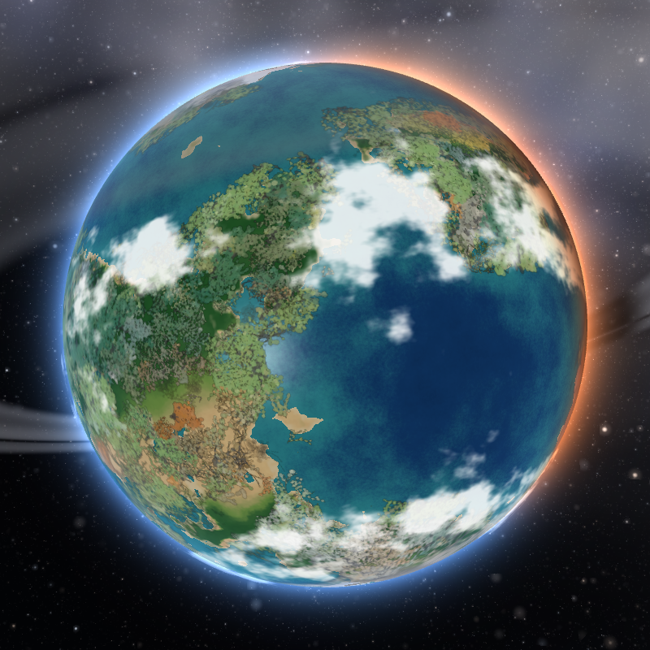
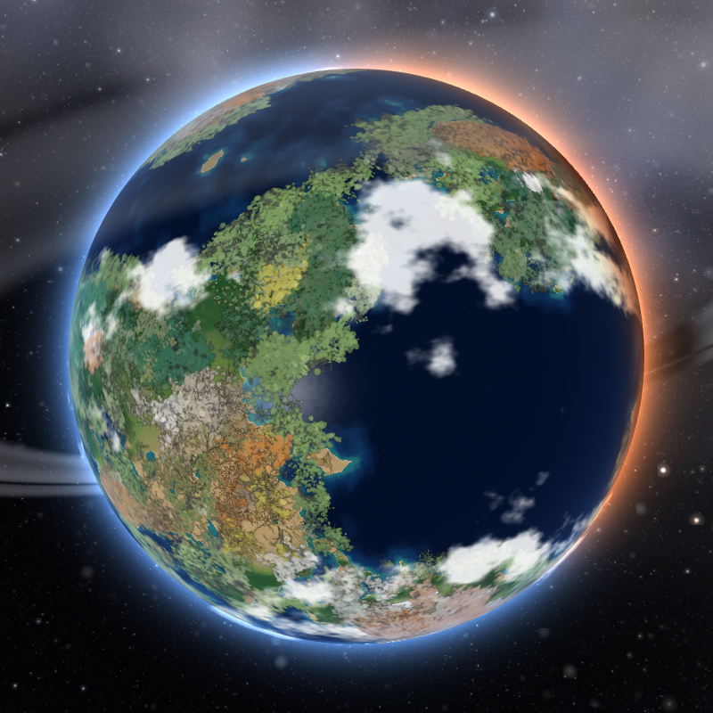

# The four world controls — what measurement said

The settings panel offers four physical controls over the world: **sea level**,
**temperature** and **rainfall**, which the climate controller steers toward
while the piece runs, and **relief**, which rebuilds the terrain and so needs a
restart. Each carries a sentence promising the visitor what it will do.

Nothing had ever checked that the promise is kept. This file is what checking
found. It is the climate companion to `plants-measured.md` and follows the same
rule: the readings that destroyed a claim are kept, because they are the useful
part.

The harness is `tools/controls.js`. Run it with `node tools/controls.js`.

## How it was measured, and the three things that are not incidental

**It proves itself before it measures anything.** Four times on this project the
thing reporting a measurement has been wrong rather than the thing measured, so
phase 0 asserts what must be true and refuses to run the rest if any of it is
false: two identical runs are identical; the ecology cannot move the climate;
`holdClimate` really does pin all three dials; and the harness's own copy of the
grid weighting reproduces the simulation's own census.

That last one caught a flaw in the harness on its first run, which is the point
of it. It disagreed by 3.5e-5, and the cause was not the grid: the controller
takes its census and *then* moves the sea level, so on a running world the
recorded share belongs to the sea level of a moment ago. Asked of a world with
the dials pinned there is no lag left and the two agree to 5e-10. An
approximation would have been debugged as a grid error.

**The ecology is switched off for every climate measurement.** Plants never
write to the climate fields, so the climate is sixteen times cheaper to run
without them — which matters at ×1, where a simulated hour is 42,857 ticks. It
is asserted rather than read off the source.

**The run works from a frozen snapshot of `index.html`.** Every page load reads
the file off disk, so an edit made while a thirty-minute run is going silently
splits it between two different programs. That happened once during this work
and the run was thrown away.

## Sea level — it does what it says

Both ends of the slider, both time-lapse speeds, both seeds. Final error 0.000
to 0.001 of ocean share, reached inside two to four simulated minutes, and the
last third of the hour holds to a swing of 0.001. The dial ends up between
−0.20 and +0.41 against a clamp of ±0.50, so it is not straining.

The `PARAMS` note claims the ocean is reachable across 0 to 0.96. Pinning the
dial at each stop with `holdClimate` and asking the world where it settles:

| dial pinned at | ocean share, four seeds |
|---|---|
| sea = −0.50 | 0.0% – 0.4% |
| sea = +0.50 | 95.5% – 98.5% |

The slider runs 15% to 90%. Comfortably inside. Nothing to change.

## Temperature — it does what it says, and the cold end is at the edge

Reaches both ends within the tolerance the simulation's own boot loop uses
(0.030 of ice share). The cold end is the marginal one: the dial finishes
between −10.7 and −14.0 against a clamp of −14, and one run pinned at exactly
−14.000. Pinned by hand:

| dial pinned at | ice share, four seeds |
|---|---|
| temp = −14 | 19.7% – 25.2% |
| temp = +14 | 2.6% – 4.8% |

The slider runs 3.4% to 19.4%, which is inside the *worst* seed's range at the
cold end and slightly outside it at the warm end — seed 424242 cannot get below
4.8%. That is a per-seed margin of about one and a half points and it did not
show up as a failure in the reach runs, so it is recorded rather than acted on.

The tail swings of 0.07 to 0.13 are the seasons, not instability: a year is 900
simulated seconds, so an hour is four of them, and `plants-measured.md` already
records the caps breathing between 6.9% and 10.3% at ×100.

## Rainfall — the dry end promised something the world would not give

**Measured, and it was wrong.** The slider ran to "80% of land desert" and the
world stopped between 55.6% and 69.5%, with the humidity dial pinned at its
clamp of −0.560 and staying there. Both speeds, both seeds, and booting straight
into it from a link. Seed 31337 missed by 0.205 to 0.244.

**And it is not the humidity clamp.** Pinned at exactly the same −0.56 by hand,
with the terrain frozen and the other two dials held, the same worlds reach
70.0% to 83.8%. The dial has the authority. Something takes it away on a running
world.

**It is this control fighting the temperature one, through the census.** Drying
the land kills the vegetation; bare dry ground does not hold snow, because the
snow term carries a moisture factor precisely so that cold *dry* ground stays
bare; the ice share therefore falls below its target; and the temperature
controller cools the whole planet by ten degrees to win it back. Mean surface
temperature goes from 20°C to 9.9°C. The census counts bare land warmer than 2°C
as **desert** and colder than 2°C as **tundra** — so at the dry end 99% of the
land really is bare, and only 56% of it is still warm enough to be *called*
desert.

| | ocean | ice | desert | tundra | grass | forest | mean °C | dial |
|---|---|---|---|---|---|---|---|---|
| `tgtdesert` 0.02 | 0.635 | 0.061 | 0.005 | 0.001 | 0.103 | 0.211 | 21.8 | +0.447 |
| `tgtdesert` 0.80 | 0.635 | 0.089 | 0.212 | 0.150 | 0 | 0 | 9.9 | **−0.560** |

Two ways out. Point the humidity controller at *bare* land — desert plus tundra
— which makes the whole range reachable and stops rainfall being measured by a
statistic that a cold snap can move on its own; or bound the slider to what the
world will honour, which is what the temperature slider already does. **Don's
call was to bound the slider**: `tgtdesert` now runs 0.02 to 0.55, and the card
says why. The controller is untouched, so the shipped world is unchanged.

## Relief — it changes the terrain, and it broke the sea level at ×100

The terrain claim holds and is roughly linear. Across the slider, four seeds:

| relief | elevation spread | mean land height | mean ocean depth | landmasses |
|---|---|---|---|---|
| 0.3 | 0.061 – 0.073 | 0.043 – 0.064 | 0.055 – 0.062 | 6 – 13 |
| 1.0 | 0.210 – 0.270 | 0.174 – 0.228 | 0.174 – 0.244 | 7 – 14 |
| 2.0 | 0.393 – 0.492 | 0.295 – 0.355 | 0.352 – 0.497 | 7 – 13 |

So "smooth shelves" against "mountains and deep basins" is real and about
sixfold. "Broken archipelagos" is the weakest part of the claim: the number of
separate landmasses is set far more by the seed than by relief, and coastline
per unit of land barely moves. The card says relief changes what the planet *is*
rather than how much of each thing it holds, and that much is exactly right.

The same seed at each end, both settled to the same 63.5% ocean — which is the
other half of the claim, that the sea finds its own level either way:

| 0.3 | 2.0 |
|---|---|
|  |  |

Pale shallow shelves and soft coasts against deep basins, hard coastlines and
rock and snow showing through on the ranges.

**But at relief 0.3, three seeds in four missed their ocean target at ×100** —
settling at 57.6%, 59.1% and 68.2% against 63.5% — while ×1 was fine on all
four. This is the case CLAUDE.md exists to catch, and it was caught by the
instruction to re-check controller bounds at ×100.

**And the first diagnosis was wrong, from an aliased trace.** Sampled every 120
simulated seconds, the ocean share sat perfectly flat at 0.679 for an hour while
the sea level crept upward — which is the signature of a correction too *small*
to arrive, and contradicts the sign of the loop. It was the sampling: at ×100 a
tick is 8.4 simulated seconds and 120 is an exact multiple of it, so every
reading landed on the same phase of a limit cycle and drew a straight line
through it. What gave it away was the harness's own cross-check — `stats.ocean`
0.6816 against an independent recomputation of 0.5734 at the same instant, a
ten-point disagreement that only a world swinging hard between readings can
produce. **Never sample a control loop at a multiple of its own period.**

**The real cause is that the correction is in the wrong units.** It is expressed
in sea level and the thing it steers is a share of the world, and the exchange
rate between them is not a constant — it is how much ground lies near the
waterline. A smooth world piles most of its elevation into a narrow band, so the
same step sweeps several times as much coastline. Measured as what one full
correction step buys in ocean share:

| relief | share moved by one correction step |
|---|---|
| 2.0 | 0.011 – 0.015 |
| 1.5 | 0.014 – 0.021 |
| 1.0 | 0.020 – 0.033 |
| 0.65 | 0.033 – 0.053 |
| 0.3 | 0.081 – 0.107 |

The three failures are exactly the three runs above 0.09, and the relief-0.3
seed that passed is the one at 0.081. The loop was stepping over its own target.

**Fixed by holding the step to a fixed cost in share rather than in sea level.**
The census already visits every cell, so it also measures the area within a
whisker of the waterline, which is the loop's gain; the correction and its rate
limit are then scaled by it. The scale is never above 1, so no world gets a
larger correction than it did before, and the cap is set just above the worst
relief-1 seed, so the shipped world is untouched by construction.

**Confirmed.** All twenty-two relief runs now hold 63.4–63.5% ocean, including
relief 0.3 at ×100 on all four seeds, and all fifty-four reach-and-hold runs
pass. The loop's raw gain is unchanged — one uneased step at relief 0.3 still
buys 0.078 to 0.122 of ocean share — so the fix is doing the work and not the
terrain.

## Axial tilt — it works everywhere and costs the balance past about 35°

Asked of the simulation rather than of the source: can the axis be a parameter?

**Structurally, yes, and cheaply.** `TILT` appears in exactly four places — the
axis vector, the sub-solar latitude, the season label and the spin matrix — and
everything else about the axis derives from `POLE`. More to the point the
climate model is **zonal**: insolation is `cos(lat − solarLat)` clamped at zero
and nothing in it knows about longitude, so a sub-solar latitude anywhere from
the equator to the pole needs no change of shape. Permanent daylight over the
summer pole and permanent night over the winter one is what that cosine already
says once the angular distance passes 90°. The one thing worth checking was the
sun basis `SUNU`, which projects a fixed vector perpendicular to `POLE` and
would be degenerate if the two were parallel; across 0–90° the dot product never
exceeds 0.554, so it never is.

**Measured across seven tilts and four seeds**, each settled for a simulated
hour and then watched through a whole further year sampled eight times, so both
solstices are looked at rather than whichever the hour ended on:

| tilt | sun reaches | verdict against verify.js's bands |
|---|---|---|
| 0° | 0.0° | all four seeds hold |
| 12° | 11.9° | all four seeds hold |
| 24° | 23.9° | all four seeds hold |
| 40° | 39.1° | 2 of 4 break — ice, forest, grass |
| 55° | 54.8° | 2 of 4 break — ice, forest |
| 70° | 69.7° | 4 of 4 break — ice, forest, desert |
| 90° | 89.6° | 4 of 4 break — ice, forest, desert |

**And the word "break" in that table is wrong — it was mine, and Don caught
it.** Those are `verify.js`'s bands, written for the default world's *steady
state*, applied to a world deliberately configured to swing. A 90° planet is
supposed to leave a 4–15% ice band. Reporting that as a failure is the same
mistake as reporting `tgtocean = 0.90` as a failure because the ocean left
62–65%. The table says which tilts stay inside the default world's envelope,
which is a useful thing to know and is not a verdict.

So the two were separated: the same year run twice, once with the dials pinned
by `holdClimate` so the physics alone decides, once with the controller
steering. At tilt 90, northern solstice, ice and mean temperature by latitude
band (dials held, seed 31337):

| band | 90–70N | 70–50N | 50–30N | 30–10N | 10N–10S | 10–30S | 30–50S | 50–70S | 70–90S |
|---|---|---|---|---|---|---|---|---|---|
| ice | **0.0%** | 0.1% | 0.0% | 1.6% | **32.0%** | 10.9% | 3.5% | 57.4% | **71.9%** |
| mean °C | **28** | 28 | 29 | 27 | 15 | 7 | 4 | −12 | **−13** |

**The model does exactly what a 90° world should do, and one thing besides.**
The summer pole is the hottest ground on the planet at 28°C with no ice at all;
the winter pole is −13°C under 72% ice. Half a year later it is the mirror
image. What is easy to miss is the middle: at 90° the sub-solar point stands
over a *pole*, so the **equator is 90° from the sun** — the terminator runs
along it — and the cold does not stop at the winter hemisphere. There is an
equatorial ice belt, 32% of the tropics under ice at 15°C mean. Warm poles and
a frozen equator is the standard high-obliquity result, and this model
reproduces it from `cos(lat − solarLat)` alone with nothing added for it.

Against the default 24° at the same moment, for contrast: north pole 4°C and
15.8% ice, equator 30°C and no ice at all, south pole −24°C and 72.8% ice.

**What genuinely degrades at high tilt is the controller, and it is a phase
lag.** Over one year at tilt 90:

| | global temperature dial | northern ice swing | southern ice swing |
|---|---|---|---|
| dials held | constant 13.91 | 25.0% | 24.3% |
| controller live | swings **4.92**, hits both clamps | **29.5%** | **29.1%** |

The controller steers global temperature on the ice share it can see now, but
at this tilt that share is set by a seasonal cap it cannot influence in time.
So it runs out of phase with the season and amplifies the swing it exists to
damp: in the live trace, with the northern cap still growing through 19.4% the
dial sits at its coldest, 9.08, and only slams to its warmest, 14.00, once the
cap has already peaked. At 24° there is nothing to see — the seasonal term is
small enough that the loop keeps up.

That is fixable — steer on a running annual mean of the ice share rather than
the instantaneous one — and it is not built, because at the shipped tilt there
is no problem to fix and the change would touch the piece's central loop.

The slider offers the full 0–90°, on the precedent the sea level slider already
sets — it goes to 90% ocean, far outside the balance the piece ships with. What
`verify.js` gates is the **default** world; the panel is where a visitor leaves
it deliberately.

**And tilt = 0 is the control arm `plants-measured.md` said it did not have.**
That file records the frozen-planet arm as unclean, because freezing stops
everything temporal including the seasons, "so it is not a clean control for
secular drift alone, and separating seasons from drift would need a new dial."
This is that dial: `#tilt=0` with `churn=1` gives coastlines that still wander
under an ice line that never moves. Measured at tilt 0 the ice share holds
8.1%–9.4% across a year, against 4.6%–12.6% at the default 24°.
